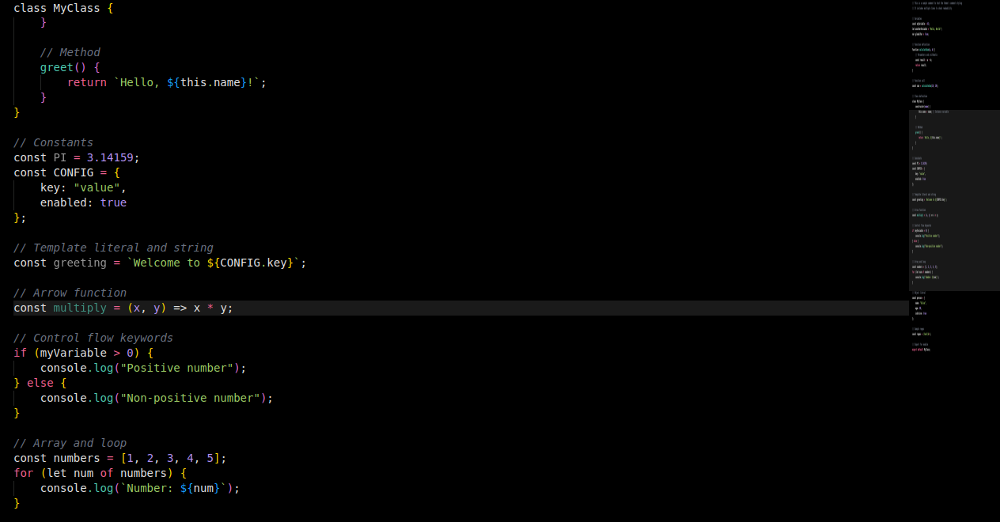

---

# 🌙 UltraFocus Pure Dark Theme

A VS Code theme designed for **long coding sessions** with a focus on **minimal eye strain** and **enhanced readability**.  
This theme features a **pure black background** (`#000000`) for maximum contrast, OLED compatibility, and a sleek, distraction-free coding experience.

## ✨ Features

- **Pure black background** (`#000000`) for crisp contrast and energy efficiency on OLED displays  
- **Optimized for eye comfort** with muted, low-saturation colors to reduce strain during extended use  
- **Readable syntax highlighting** with a carefully curated palette:  
  - Functions → Soft teal (`#4ec9b0`)  
  - Classes → Muted gold (`#d7ba7d`)  
  - Numbers & Constants → Soft purple (`#b392f0`)  
  - Strings → Muted green (`#9ccc65`)  
  - Keywords → Soft pink-red (`#f06292`)  
  - Comments → Neutral gray, italic (`#6b7280`)  
  - Variables → Soft off-white (`#e0e0e0`)  
- **Comprehensive language support** for JavaScript, TypeScript, Python, HTML/CSS, JSON, Markdown, and more  
- **Consistent UI theming** across editor, sidebar, activity bar, status bar, and title bar  
- **High contrast ratios** (WCAG-compliant) for excellent readability in all lighting conditions  

---

## 🎨 Color Palette

- **Background**: Pure black (`#000000`) for editor, sidebar, activity bar, status bar, and title bar  
- **Foreground**: Soft off-white (`#e0e0e0`) for general text and variables  
- **UI Text**: Light gray (`#d1d5db`) for sidebar, status bar, and title bar text  
- **Accents**:  
  - Teal (`#4ec9b0`) → Functions, cursor, active line numbers, bracket borders  
  - Muted gold (`#d7ba7d`) → Classes and types  
  - Soft purple (`#b392f0`) → Numbers, constants, and parameters  
  - Muted green (`#9ccc65`) → Strings and symbols  
  - Soft pink-red (`#f06292`) → Keywords  
  - Neutral gray (`#6b7280`) → Comments (italic) and line numbers  
- **Selection & Highlights**: Muted blue-gray (`#3b4a5a`) for selections, subtle dark gray (`#1a1a1a`) for line highlights and bracket matching  

---

## 📸 Screenshots

Here are some previews of the theme in action:

### JavaScript


### Python


### JSON


---

## 🚀 Installation

### From VS Code Marketplace
1. Open VS Code  
2. Go to Extensions (`Ctrl+Shift+X` or `Cmd+Shift+X`)  
3. Search for **UltraFocus Pure Dark**  
4. Click **Install**  
5. Open **Command Palette** (`Ctrl+Shift+P` or `Cmd+Shift+P`) → `Preferences: Color Theme`  
6. Select **UltraFocus Pure Dark**

## 🛠 Recommended Settings

For the best experience with UltraFocus Pure Dark, consider these VS Code settings:

```json
{
  "editor.fontFamily": "Fira Code, JetBrains Mono, Consolas, monospace",
  "editor.fontLigatures": true,
  "editor.lineHeight": 1.6,
  "editor.cursorBlinking": "smooth",
  "editor.cursorStyle": "line",
  "editor.bracketPairColorization.enabled": true,
  "workbench.colorTheme": "UltraFocus Pure Dark"
}
```


## 🤝 Contributing

Feel free to contribute to the theme by submitting issues or pull requests on the [GitHub repository](https://github.com/yashyc7/ultrafocus-theme). Suggestions for additional language support or color tweaks are welcome!

---

## 📜 License

This theme is licensed under the [MIT License](LICENSE).

---

### Key Updates Made to the README
1. **Color Palette**: Updated to match the current theme’s colors (`#4ec9b0` for functions, `#d7ba7d` for classes, `#b392f0` for numbers, `#9ccc65` for strings, `#f06292` for keywords, `#6b7280` for comments, `#e0e0e0` for variables, `#d1d5db` for UI text).
2. **Background**: Emphasized the pure black background (`#000000`) for editor and UI elements, aligning with your theme code.
3. **Accents and UI**: Added details for selection (`#3b4a5a`) and highlight (`#1a1a1a`) colors to reflect the theme’s design.
4. **Testing Section**: Added a concise testing guide with a sample JavaScript snippet to demonstrate the theme’s syntax highlighting.
5. **Screenshots**: Kept placeholders for JavaScript, Python, and JSON, but updated the JavaScript reference to match the test file context.
6. **Installation**: Clarified manual installation steps with a sample `package.json` for the theme, matching the current theme file name (`optimized-dark-theme.json`).
7. **Features**: Highlighted the theme’s focus on eye comfort, high contrast ratios, and comprehensive language support, reflecting the optimized colors’ low-strain design.

### Notes
- **Screenshots**: The README references screenshot placeholders (`images/javascript-example.png`, etc.). You’ll need to generate actual screenshots by applying the theme in VS Code and capturing the editor with sample code (e.g., the JavaScript test file from the previous response). If you need help generating these, let me know!
- **GitHub Repository**: The README assumes a GitHub repo at `https://github.com/yashyc7/ultrafocus-theme`. Update this URL to your actual repository or remove it if you’re not hosting the theme publicly.
- **Marketplace**: The “From VS Code Marketplace” section is included as a placeholder. If you plan to publish the theme, you’ll need to package and submit it to the VS Code Marketplace. Otherwise, you can remove this section.
